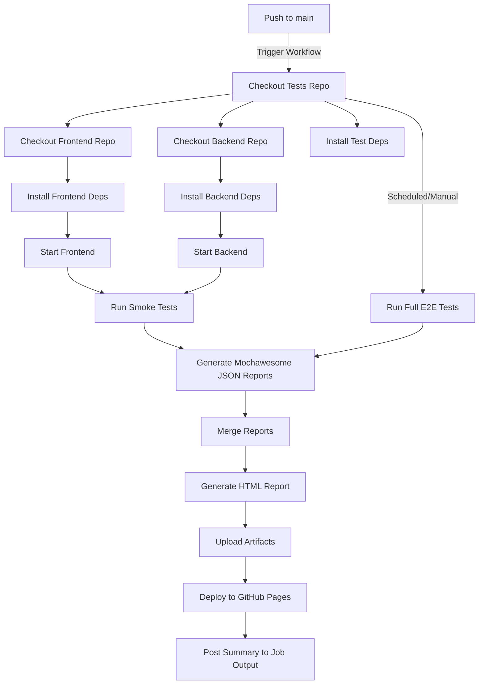

---

# Juppa Tests

Automated **Cypress** test suite for the Juppa platform — covering **smoke** and **end-to-end (E2E)** scenarios across the frontend and backend services.

This repository is designed to integrate tightly with our **frontend** (`juppa-frontend`) and **backend** (`juppa-backend`) repos, running against real services to ensure **end-to-end confidence before release**.

---

## 🚀 What This Repo Does

* **Runs Cypress tests** for both smoke and full regression scenarios
* **Starts frontend & backend** locally before executing tests
* **Generates rich HTML reports** with [Mochawesome](https://github.com/adamgruber/mochawesome)
* **Publishes reports to GitHub Pages** for easy access
* Supports **push-triggered smoke tests** and **scheduled/manual full runs**

---

## 📂 Repo Structure

```
cypress/
  e2e/             # Test specs
  support/         # Cypress custom commands & hooks
  reports/         # Individual test run JSON results
juppa-frontend/    # Checked-out frontend repo (GitHub Actions)
juppa-backend/     # Checked-out backend repo (GitHub Actions)
package.json       # Test scripts & dependencies
```

---

## 🧪 Test Types

| Type      | Trigger            | Scope                 | Runtime |
| --------- | ------------------ | --------------------- | ------- |
| **Smoke** | Push to `main`     | Critical user flows   | \~2-3m  |
| **E2E**   | Manual / Scheduled | Full regression suite | Longer  |

---

## 📦 Key Scripts

```bash
# Lint Cypress test files
npm run lint

# Run smoke tests locally
npm run test:smoke

# Run full E2E regression
npm run test:e2e
```

---

## 🛠 Local Setup

**Prerequisites**:

* Node.js 18+
* Python 3.10+
* npm & pip
* Frontend & backend repos cloned locally

**Install dependencies:**

```bash
npm ci
npm --prefix juppa-frontend ci
pip install -r juppa-backend/requirements.txt
```

**Run smoke tests locally:**

```bash
npm run test:smoke
```

---

## ⚙️ CI/CD Workflow Highlights

* **Multi-repo checkout** → pulls `juppa-frontend` and `juppa-backend`
* **Parallel service startup** → backend (Django) + frontend (Node) via `start-server-and-test`
* **Conditional execution**:

  * `push` → smoke tests only
  * `workflow_dispatch` / nightly cron → full E2E
* **Mochawesome reports** → merged, converted to HTML, deployed to GitHub Pages
* **Test summary in PR checks** → pass rate, counts, duration, link to full report

---

## 📊 Test Reporting

After each CI run:

1. JSON results are merged (`mochawesome-merge`)
2. HTML report generated (`marge`)
3. Report deployed to GitHub Pages:

   ```
   https://<your-username>.github.io/juppa-tests/
   ```
4. Summary added to the GitHub Actions job:

   ```
   ✅ Passed: X
   ❌ Failed: Y
   ⏭ Pending: Z
   📊 Pass rate: NN%
   ```

---

## 🖼 CI/CD Flow Diagram



---

## 🏗 Tech Stack

* **Testing:** Cypress 12.x
* **Reports:** Mochawesome
* **Orchestration:** npm-run-all, start-server-and-test
* **CI/CD:** GitHub Actions
* **Languages:** JavaScript (tests), Python (backend), Node.js (frontend)

---

## 📅 Maintenance Notes

* Keep Cypress & Mochawesome versions aligned across repos
* Review and update smoke test tags (`@smoke`) to match evolving critical paths
* Validate frontend/backend start commands if project structure changes
* Rotate scheduled runs to match release cadence

---

